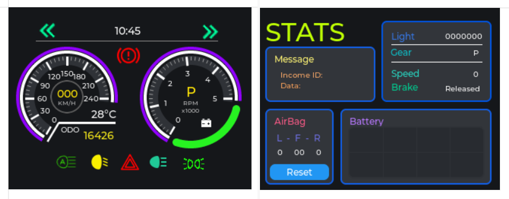

# Instrument cluster STM3
Educational grade firmware and reference implementation for STM32 MCUs
Electronic components I used: STM32F407VET6 + ILI9341.

  

  

### How to import a project in CubeMX
 _File > Import > Existing Projects into Workspace > Select archive file > ***Where you clone this repo***_
 > Support me by leaving a star at the upper right corner
