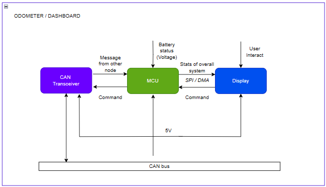

# Instrument cluster STM3
Educational grade firmware and reference implementation for STM32 MCUs.<br>
Electronic components I used: STM32F407VET6 + ILI9341.<br>
<div align="center">
  
</div>
<div align="center">
  
</div>
###Block Diagram
Depending on what you prefer, I picked MCCP2551 for this project.<br>
<div align="center">
  
</div>

```
	float volt = HAL_ADC_GetValue(&hadc1) * 3.3f/4095.0f * 4.24f;
	float pct  = (volt - 8.25f)/(12.6f - 8.25f) * 100.0f;
```
> [!NOTE]
> The ratio of the voltage divider I used is 4.24, while the input battery source ranges from 8.25 to 12.6 as a 3S Li-ion (check datasheet).<br>

### How to import a project in CubeMX
 _File > Import > Existing Projects into Workspace > Select archive file > ***Where you clone this repo***_
 > Support me by leaving a star in the upper right corner
